# ЛАБОРАТОРНАЯ РАБОТА №14. Работа со встроенной утилитой ОС WINDOWS «Диспетчер задач».

Цель работы: получить практические навыки работы с диспетчером задач, изучить его функции и возможности.

1. Проверьте все способы запуска Диспетчера задач, занесите в отчёт, запомните для себя самый подходящий способ.
   
   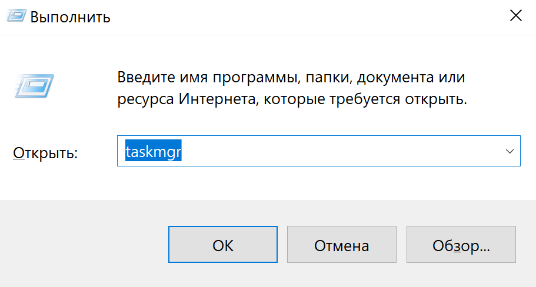
   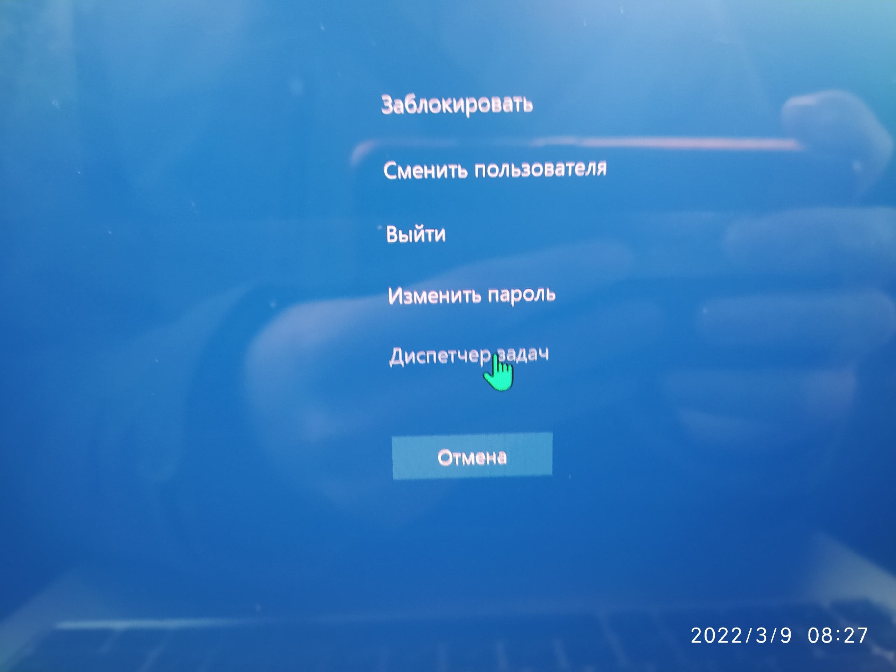
    - Нажатие Ctrl+Shift+Escape
2. Посмотрите с помощью Диспетчера задач (вкладка «Приложения»), какие задачи у пользователя работают в данный момент.
   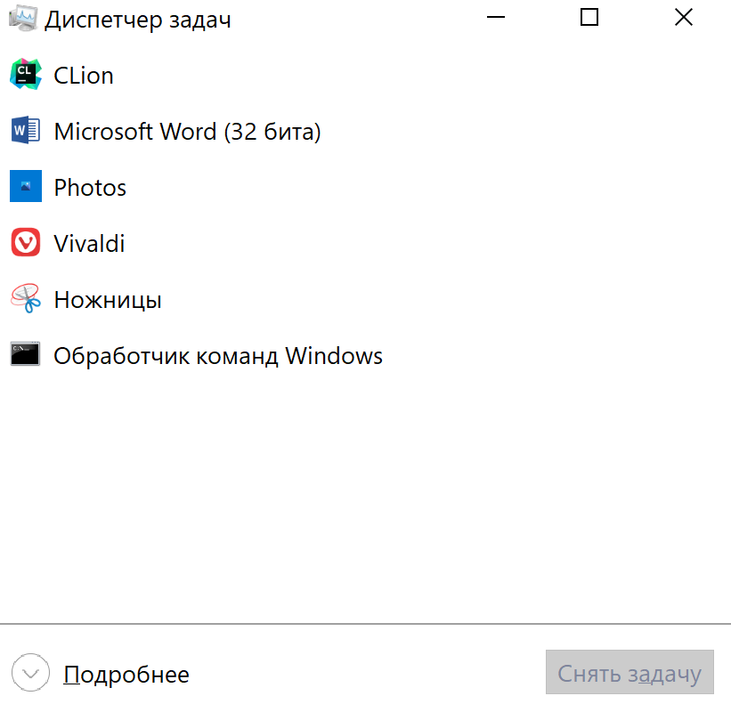
3. Как в новой версии запустить новую задачу?
   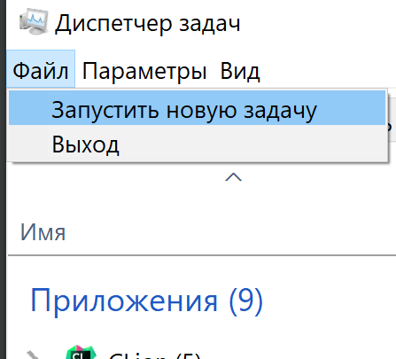
4. Введите команду Tasklist /SVC и нажмите клавишу ENTER. Перечислите процессы, обеспечивающие работу более, чем одной
   службы.
   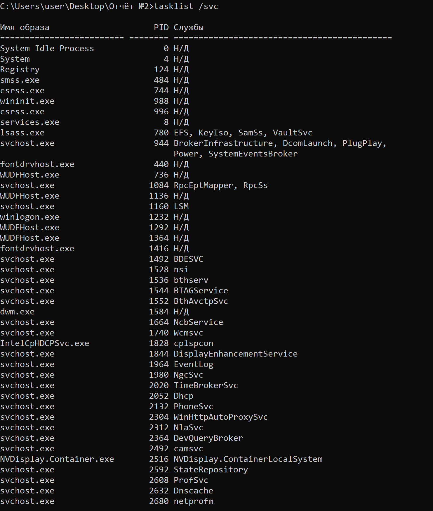
   Процессы с несколькими службами:
    - svchost.exe 944 BrokerInfrastructure, DcomLaunch, PlugPlay, Power, SystemEventsBroker
    - svchost.exe 1084 RpcEptMapper, RpcSs
    - svchost.exe 12104 OneSyncSvc_178bf0, PimIndexMaintenanceSvc_178bf0, UnistoreSvc_178bf0, UserDataSvc_178bf0
    - lsass.exe 780 EFS, KeyIso, SamSs, VaultSvc
5. Получите дополнительные сведения о процессе, ассоциированном с Диспетчером задач.
   
6. Пользуясь командой WHERE и шаблоном поиска найдите все DLL-файлы в папке c:\windows (поиск должен быть рекурсивным,
   т.е. по всем вложенным папкам). Сделайте скриншот фрагмента по-иска, назовите общее число таких файлов.

```cmd
WHERE /R c:\windows *.dll | find /v "" /c
WHERE /R c:\windows *.dll
```


7. С помощью команды ECHO и параметра %SystemRoot% выведите путь до системной папки. Приведите примеры нескольких
   переменных среды Windows 10, исследовав этот вопрос самостоятельно.
   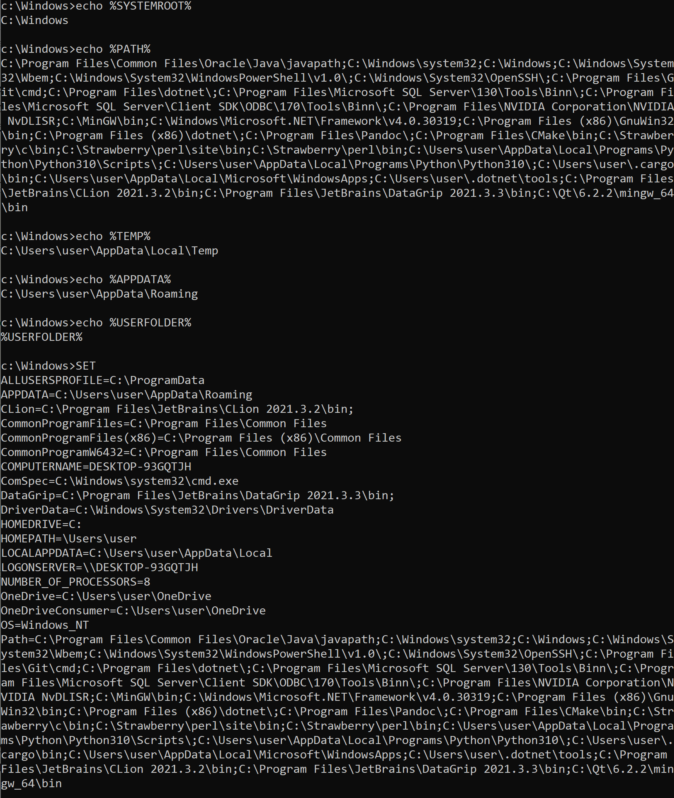
8. Выведите список процессов с PID в диапазоне от 0 до 700+№ студента по списку*10. Какие из перечисленных в
   теоретической части процессов попадают в этот список? Выполните перезагрузку системы, затем повторите указанный
   действия, сравните результат с предыдущим, сделайте вывод.

```powershell 
gps | where{$_.id -lt 713} | sort -Property ID
```


После перезапуска:

Вывод: есть предположения, что id до 127 не назначаются случайно.

9. За что отвечает вкладка «Приложения»? \
Отображает запущенные на данный момент приложения.
10. Существуют ли приложения, которые не следует завершать? \
Нет, в основном тебе Windows не даст завершить важные **
    приложения**.
11. Какая информация содержится во вкладке «Процессы»? \
Информация о процессах, которые запущены в данный момент.
12. Выпишите названия служб: криптографии, маршрутизации и удалённого доступа, диспетчера печати. Есть ли в списке
    службы с одинаковыми ИД процесса? Если да, то приведите пример и объясните почему?
    <br>Служба криптографии: 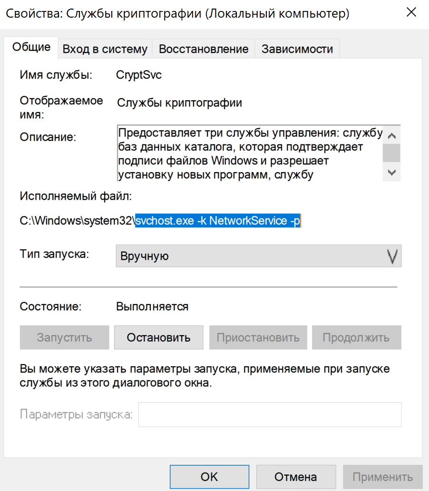 <br> Службы маршрутизации: 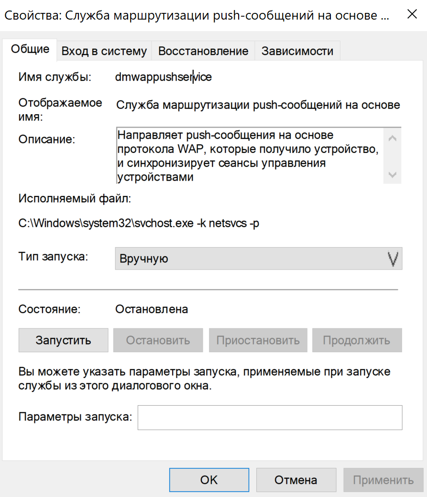
    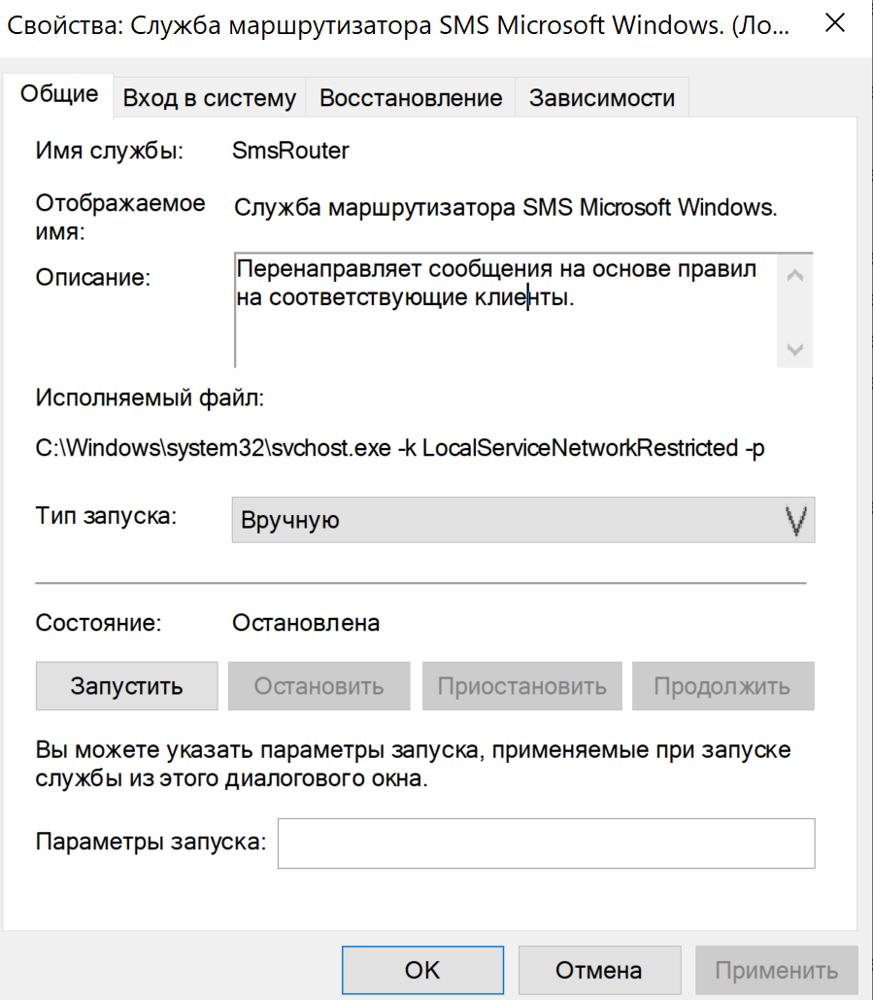 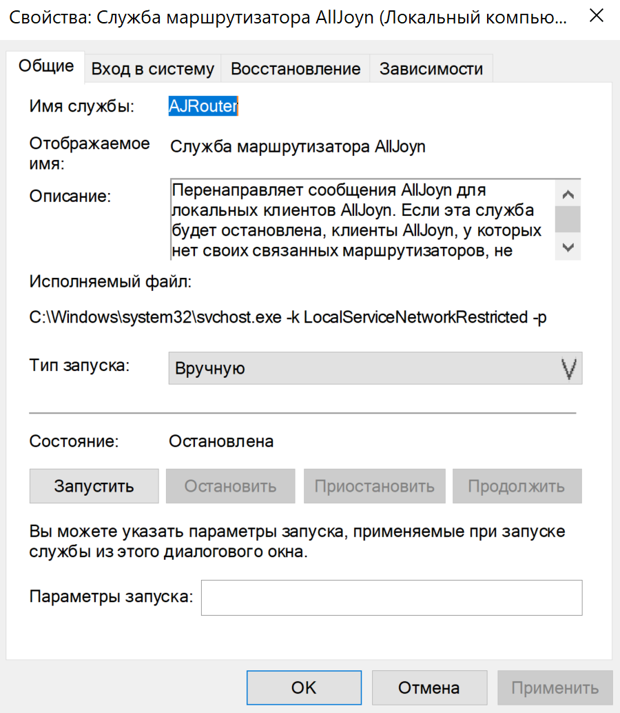 <br> Службы удалённого доступа: 
    <br> Да 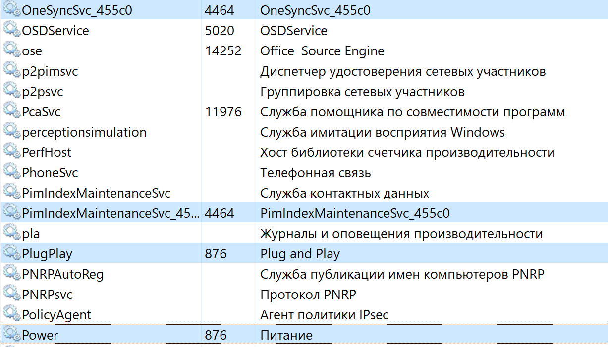 <br> Они используют информацию(контекст) с одного процесса.
13. Какую информацию предоставляет вкладка Службы? <br> Показывает какие службы сейчас выполняются.
14. Зачем нужна вкладка Быстродействие? <br> Показывает сведения об использованных ресурсов компьютера.
15. Что такое файл подкачки? Можно ли задать его размер?<br> Это заполнение физической памяти при недостатке ОЗУ. В панели
    управления, в настройке представления и производительности системы.
16. Что показывает вкладка Сеть? <br> Список имеющихся сетевых подключений и графики их активности.
17. Можно ли по сетевой активности судить о вирусной активности? <br> Вполне себе можно, но если вы уверены, сколько вы сети
    тратите в данный момент.
18. Какие функции показывает вкладка Пользователи. <br> Список активных пользователей.

Контрольные вопросы:

1. Сколько экземпляров svchost.exe может быть запущенно на компьютере? Почему? <br> Да. Предположительно для обеспечения
   работы разных групп служб и запуск их в разное время.
2. Что такое spoolsv.exe? <br> Процесс управляющий печатью.
3. Чем отличается файл подкачки от виртуальной памяти? <br> Где можно увидеть? Виртуальная память включает в себя файл
   подкачки и основную память. В панели быстродействия
4. Дескриптор файла это - это неотрицательное целое число. Когда создается новый поток ввода-вывода, ядро возвращает
   процессу, создавшему поток ввода-вывода, его файловый дескриптор.
5. Что такое службы? Для чего предназначены?<br> Программы, которые работают в фоновом режиме. Это приложения, автоматически
   запускаемые системой при запуске Windows и выполняющиеся вне зависимости от статуса пользователя.
6. Что необходимо сделать, чтобы запустить настройку системы? <br> Запустить msconfig
7. Что обеспечивает обычный запуск операционной системы? <br> Загрузку всех драйверов и запуск всех служб.
8. В каком случае рекомендуется использовать диагностический запуск? <br> Когда нужен запуск без установленного ПО. В
   основном нужен когда ты накосячил.
9. Что такое system.ini? Для чего он нужен? <br> Использовался в ранних версиях Windows для хранения настроек компьютера.
10. Что обеспечивает раздел boot? <br> boot содержит файлы, которые используются не операционной системой, а ее загрузчиком
11. Какие функции возложены на файл boot.ini? <br> Файл конфигурации загрузки системы
12. Что такое Application Layer Gateway Service? <br> Обеспечивает поддержку подключаемых модулей сторонних протоколов для
    общего доступа к подключению к Интернету.
13. Что такое timeout, rdisk(0), disk(0), default? <br> Составляющие файла конфигурации boot.ini:
    - timeout — время ожидания, пока пользователь выберет вариант загрузки (задаётся в секундах)
    - rdisk(n) — порядковый номер жёсткого диска, с которого осуществляется загрузка. От 0 до 3.
    - disk(0) — обычно равен 0 (в случае использования multi(*)).
    - default — ОС по умолчанию. То есть та ОС, которая будет выбрана по истечении времени «timeout», если пользователь
      не сделает никакого выбора
14. Что делает Computer Browser? <br> Обеспечивает поддержку стороннего протокола для общего доступа к подключению к
    Интернету
15. Расскажите про Cryptographic Services? <br> Предоставляет три службы управления: службу баз данных каталога, которая
    проверяет цифровые подписи файлов Windows; службу защищенного корня, которая добавляет и удаляет сертификаты
    доверенного корня центра сертификации с этого компьютера; и службу ключей, которая позволяет подавать заявки на
    сертификаты с этого компьютера


