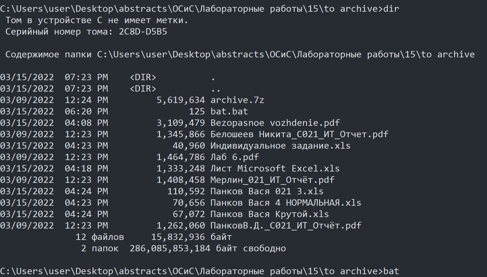
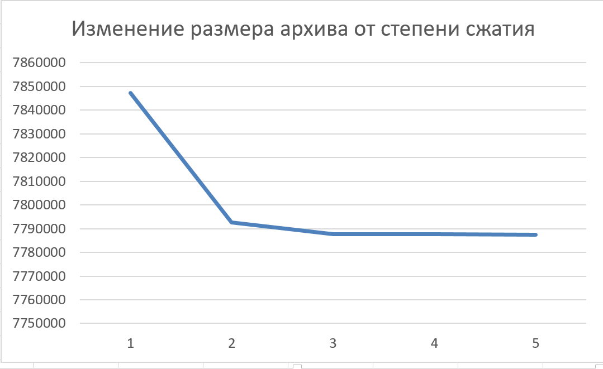
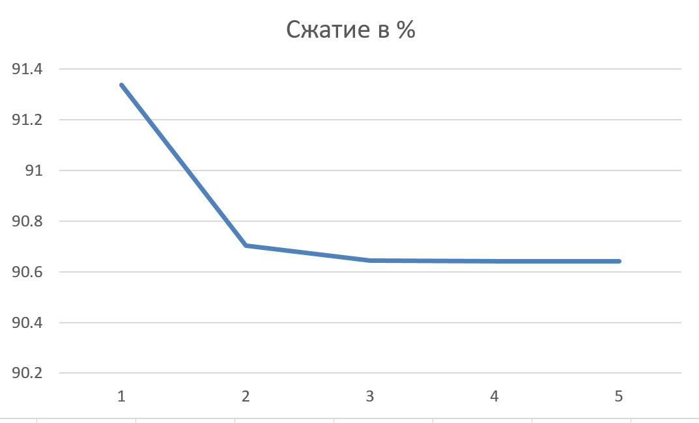
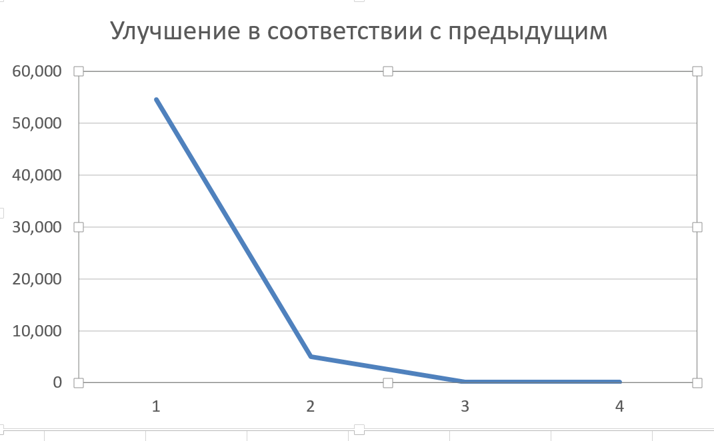
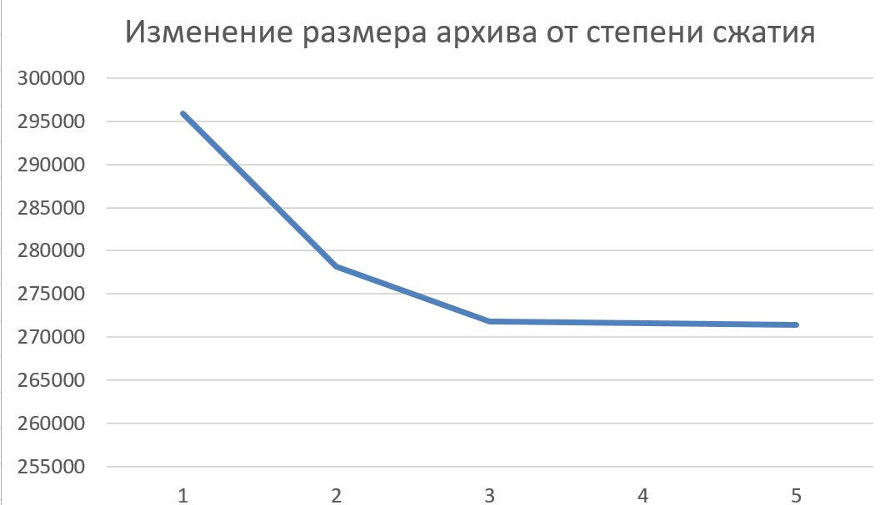
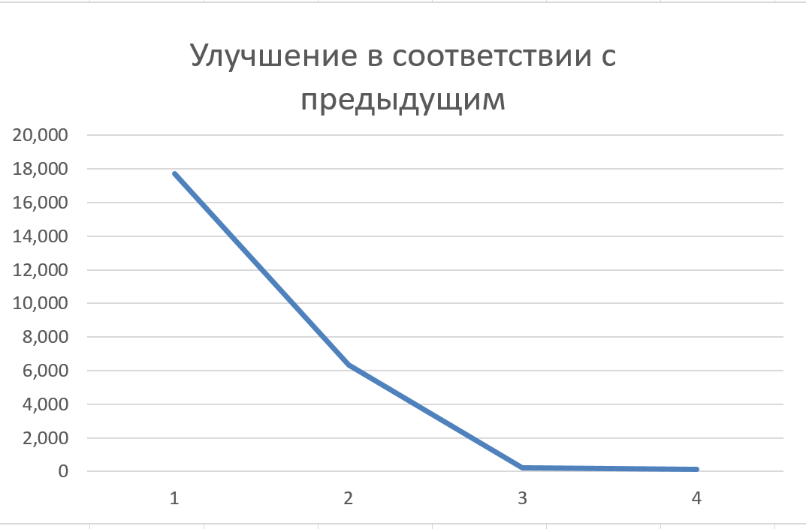
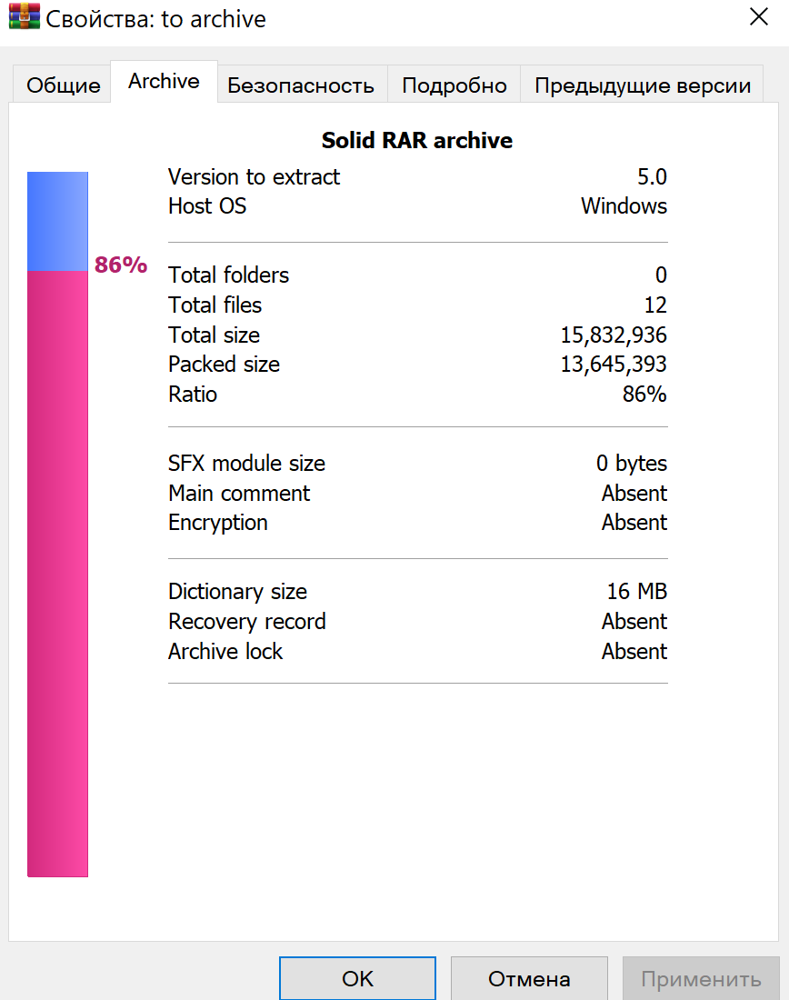
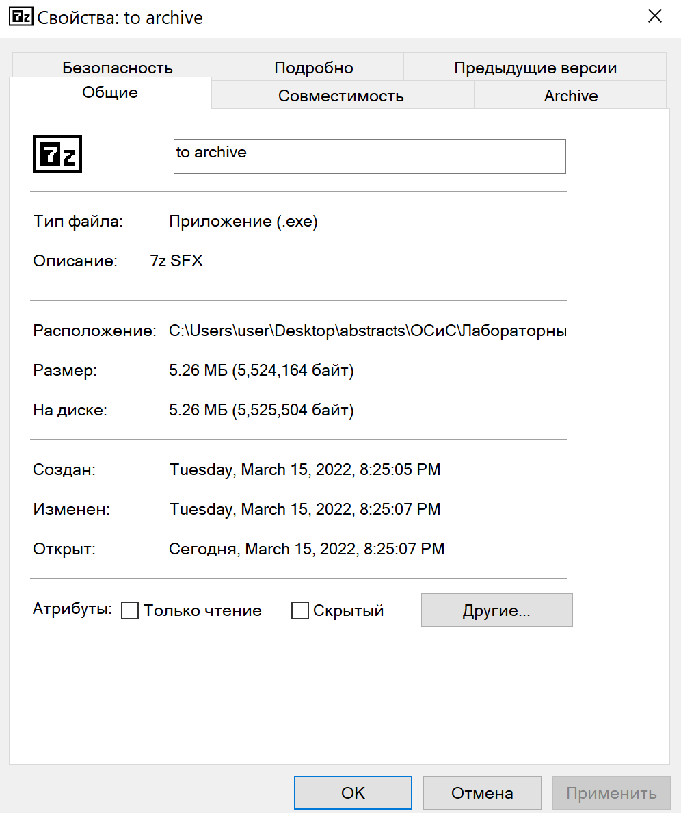

# ЛАБОРАТОРНАЯ РАБОТА №15. Архивация данных. Сравнение методов сжатия информации.

Цель работы: получить практические навыки работы с программой-архиватором WinRAR, научиться объединять файлы в архив,
задавать параметры архива, осуществлять операции с архивными файлами.

Так как WinRar имеет консольные команды, как и 7z(только он лучше и не использует проприетарный форматы), то можно
написал небольшой .bat файл:

```cmd
@echo OFF
FOR %%x IN (0 1 2 3 4 5) DO rar a  1_%%x.rar *.pdf -m%%x
FOR %%x IN (0 1 2 3 4 5) DO rar a  2_%%x.rar *.xls -m%%x
```

Исходные файлы:



Полученные архивы:


Таблица для .pdf:


Графики для .pdf:





Таблица для .xls:


Графики для .xls:





**Итоги**: как можно заметить самое эффективное сжатие происходит в первых трёх степенях сжатия, остальные же не сильно
влияют на размер, но если у вас каждый байт на счету, то лучше сжимать по максимуму.

Непрерывный архив:



Разделённый архив:


Самораспаковывающийся архив:


