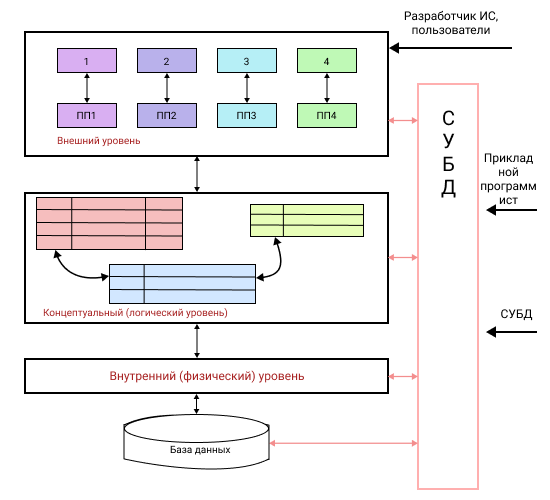

Основные понятия и определения
==============================

**Информация** - любые сведения о каком-либо событии, процессе, объекте.

**Данные** - это инфрмация, предоставленная в опр. виде, позволяющем
автоматизировать её сбор, хранение и дальнейшую обработку человеком или
информационным средством.

Основные направления вычислительной техники:

-   Первое направление - применение вычислительной техники для задач которые
    сложно или невозможно посчитать вручную

-   Второе направление - применение вычислительной техники автоматически.

**Информационная система** - программный комплекс, функции которого состоят в
поддержке надёжного хранения информации в памяти компьютера, выполнении
спецефических для данного приложения преобразований информации и/или вычислений,
преоставлении пользователям удобного и легко осваиваемого интерфейса.

**Иформационная система** - это система, реализующая сбор, хранение, обработку,
манипулирование данными, функционирующая на основе ЭВМ и других технических
средств обработки данных, и включ. соответствующее ПО и обслужавующий персонал

**Предметная область** - это отражение в БД совокупность объектов реального мира
с их связями, относящихся к некоторой области знаний и имеющих практическую
ценность для пользователей.

**Объект** - элемент информационной системы, информацию о котором мы сохраняем.

**Класс объектов** - совокупность объектов, обладающих одинаковым нобором
данных.

Каждый объект имеет набор опр. свойств. Атрибут - это информационное отображение
свойств объекта.

**Банк данных(БнД)** - *система из нескольких баз данных* или это система
специально организованных данных, программынх языковых, организационных и
технических средств, предназначенных длая централизованного накопления и
коллективного многоцелевого использованя данных.фф

В состав БнД входят:

-   БД

-   СУБД

-   Словарь данных

-   ВС (Программные и техничесские средства)

-   Администратор базы данных

-   Обученный персонал

**База данных** - это именновая совокупность данных, отражающая состояние
объектов и их отнощений в рассматриваемой предметной области.

СУБД - Система управления баз данных - совокупность программны

 

Структура и функции банков данных.
----------------------------------

Функции банков(баз) данных:

-   Ввод, просмотр и редактирование данных

-   Хранение данных и их защиты

-   Изменение хранимых данных

-   Поиск, сортировка и отбор данных по запросам пользователей

-   Отображение результатов в требуемом виде

В структуе данных выделяют следующие компоненты:

-   Информационная база

-   Лингвистические средства

-   Программные средства

-   Технические средства нормативные документы

-   Нормативно-методическое обеспечение и организационно-административные
    подсистемы

**Информационная база** - это данные отражающие состояние опрю предметной
области и используемой ИС.  
Состоит из 2-ух компонентов:

-   Метаданные - описанние данных

-   Коллекция записей - собственно данных

Различают три уровня предастовления данных: внешний, концептуальный и
внутренний.

**Внешний уровень** - Каждая группа пользователей выделяет в моделируемой
предметной области, общей для всей организации, те объекты, атрибуты и связи,
которые ей интересны. Выражая их в наиболее удобной для себя форме, она
формирует своё пользовательское представление, причём одни и те же данные могут
отображаться в разных пользовательских представлениях.

**НОРМАЛИЗАЦИЯ(ДАННЫЕ НЕ ДОЛЖНЫ ПОВТОРЯТЬСЯ)**

Концептуальный (логический) уровень проектирования БД включает анализ
информационных потребностей пользователей и определение нужных элементов данных.
Таким образом, концептуальная схема - это единое логическое описание всех
элементов данных и отношений между ними, логическая структура БД.  
Для каждой БД имеется только одна концепутальная схема содержащая:

-   Объкты и их атрибуты

-   Связи между объектами

-   Ограничения накладываемые на данные

-   Семантическую информацию о данных

-   Обеспечение безопасности и поддержки целостности данных

Не содержит информации о  хранении.

Внутренний (физический) уровень. Внутренная схема описывает физическую
реализацию БД и предназначена для достижения максимальной проихводительности и
обеспечения экономного использования дискового пространства.  
На внутреннем уровне храниться следующая информация:

-   Распраделении дискового пространства для хранения данных и индексов

-   Описание подробностей сохранения записей

-   Сведения о размещении записей

-   Сведении о сжатии данных и выбранных методах их шифрования

### Лингвистические средства

Многоуровневое представление БД предполагает соответсвующие описания данных на
каждом уровне и согласование их на разноых уровнях. Для этого в состав СУБД
включаются спецальные языки называемые языками баз данных:

1.  Язык определения данных ЯОД (DDL - Data Definitional Language) В ранних СУБД
    это язык определения БД

2.  Язык манипулирования данными - ЯМД(DML - Data Manipulation Language)

**Язык определения данных** - описательный язык с помощью которого описывается
предметная область: именуются объекты, определяются их свойства и связи между
объектами. Он используется главным образом для определения логической структуры
базы данных, т. е. структуры БД, какой она представляется пользователе.
Результатом компиляции ЯОД является набор таблиц, хранимый в системном каталоге,
в котором содержатся метаданные, т. е.

 

Язык манипулирования данными содержит набор операторов манипулирования данными.
Гибкость управления БД.

 

Множество операций можно классифицировать следующая образом:

1.  Операции селекции

2.  Дествия над данными

    -   Выборка-чтение записи из БД

    -   Включение - Ввод записи в БД с установкой её связей

    -   Удаление - исключение записи из БД с установкой новых связей

    -   Модификация - изменение содержимого записи и корекция связей при
        необходимости

ЯМД:

-   процедурный

-   декларативный(непроцедурный)

 
