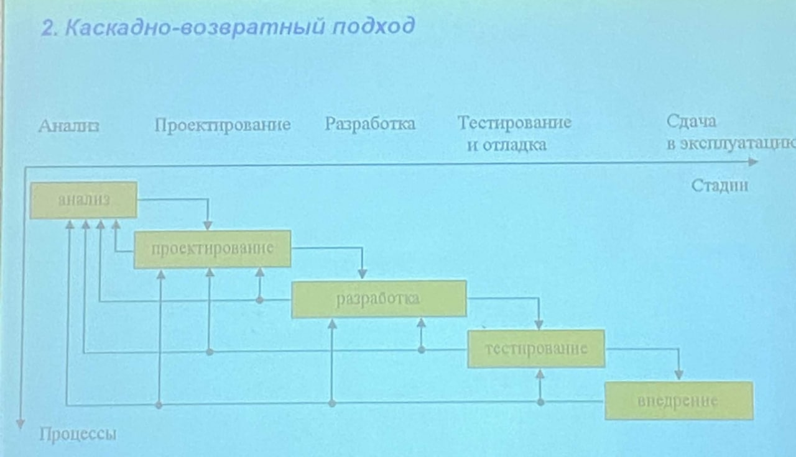
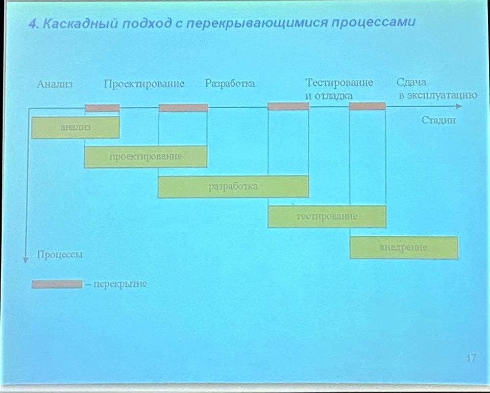

Технология разработки программного обеспечения
==============================================

9 лабораторных работ

Основные понятия и определения
------------------------------

**Технология программирования**- совокупность методов и средств, проверяемых в процессе разработки ПО.

**Программа(program, routine)** - упорядоченная последовательность команд(инструкций) компьютера для решения задачи.

**Программное обеспечение(Software)** - совокупность программ обработки данных и необходимость для их эксплуатации
документов.

**Задача(problem, task)** - проблема, подлежащая решению.

**Приложение (application)** - программная реализация на компьютере решения задачи.

**Программный продукт(ПП)** - это комплекс взаимосвязанных программ, предназначенный для реализации опр. Задачи
массового спроса.

Этапы создания программ:

1. Постановка задачи

2. Алгоритмизация решения задачи

3. Программирование

**Постановка задачи(problem definition)** - это точная формулировка решения задачи на компьютере

С описанием входной и выходной информации.

**Алгоритм** - система точно сформулированных правил, определяющая процесс преобразования допустимых исходных данных(входной информации) в желаемый результат(выходную информацию) за конечное число шагов.

**Сопровождение программы**- поддержка работоспособности программы, переход на её новые версии, внесение изменений,
исправление ошибок и т. д.

По отношению к ПО пользователи ПК делятся на следующие группы:

- Конечные пользователи - элементарные навыки работы с компьютером

- Администраторы сети - отвечают за работу вычислительных сетей

- АДБ[^1]

  [^1]: Администраторы баз данных

- Системные программисты - занимаются разработкой, эксплуатацией и сопровождением системного программного обеспечения

- Прикладные программисты - осуществляют разработку и отладку программ для решения различных прикладных задач.

### Основные характеристики программ:

- Алгоритмическая сложность

- состав функций обработки информации

- объем файлов, используемых программой

- требования к ОС и техническим средствам обработки, в том числе объем дисковой памяти, размер ОЗУ для запуска
  программы, тип CPU, версия ОС и тп.

### Показатели качества:

1. мобильность (многоплатформенность) - независимость от технического комплекса системы обработки данных, ОС, сетевых
   возможностей, специфики предметной области задачи и т. д.

2. надежность - устойчивость, точность выполнения предписанных функций обработки, возможность диагностики возникающих
   ошибок в работе программы

3. эффективность - как с точки зрения требования пользователя, так и расхода вычислительных ресурсов

4. учёт человеческого фактора - дружественный интерфейс, контекстно-зависимая подсказка, хорошая документация

5. модифицируемость - способность к внесению изменений, например, расширение функций обработки, переход на другую
   техническую базу обработки и т.п.

6. коммуникативность - максимально возможная интеграция с другими программами, обеспечение обмена данными между
   программами

### Критерии оценки качества программы

Программа должна:

1. работать согласно тех. заданию (и это легко проверяется)

2. быть эффективна по быстродействию и памяти(или быстрее работать, или занимать меньше памяти)

3. широко использоваться или быть доступна

4. достаточно надежно в процессе расчёта получать достоверные результаты

5. должна быть разработана в срок и отлажена с минимальным трудозатратами

### Структура программных продуктов

Архитектура ПП представляет собой совокупность и взаимосвязь программных модуль

**Модуль** - это самостоятельная часть программы имеющая определённое назначение и обеспечивающая заданные функции
обработки автономно от других программных модулей.

Программный продукт обладает внутренней структурой

Структуризация программа:

- разработки

- программирования

- отгадки

- внесения изменения в ПП

Программные комплексы большой алгоритмической сложности разрабатываются коллективом разработчиков(2 - 15 человек).
Управление программ основывается на научном подходе.

**Структуризация преследует следующие цели:**

- Распределить работы по исполнителям, обеспечив их загрузку и требуемые сроки разработки

- Построить календарные графики проектных работ и осуществлять их координацию в процессе создание программных изделий

- Контролировать трудозатраты и стоимость проектных работ

Структурное разбиение программ на отдельные составляющие служит основой и для выбора средств их создания. При создании
ПП выделяются многократно используемые модули, проводится их типизация и унификация, за счет чего сокращаются сроки и
трудозатраты на разработку ПП в целом.

Среди множества модулей различают:

- Головной модуль - управляет запуском ПП

- Управляющий модуль - обеспечивает вызов других модулей на обработку

- Рабочие модули - выполняют функции обработки

- Сервисные модули, библиотеки, утилиты - осуществляют обслуживающие функции

 

Каждый модуль оформляется как самостоятельно хранимый файл Для функционирования ПП необходима наличие программных
модулей в полном составе Во время работы ПП активизируются необходимые программные модули

Управляющие модули задают последовательность вызова на выполнения очередного модуля.  
Информационная связь модулей обеспечивается за счёт использования общей БЛ либо межмодульной передачи данных через
переменные обмена.

 

Жизненный цикл программы.
-------------------------

Жизненный цикл ПО - это последовательность этапов, которые проходит программа в ходе своего существования.

Особенностью разработки ПП является принятие решений на начальных этапах с их реализаций на следующих этапах.  
Ошибки в требования к ПП способны привести не только к потерям в этапах в разработке и эксплуатации, но и к провалу
проекта.

**Основные этапы жизненного цикла ПО:**

- анализ требований

- проектирование

- программирование

- тестирование и отладка

- эксплуатация и поддержка

### Анализ требований

Эмпирический закон:

30% - анализ и проектирование

40% - программирование

30% - тестирование

**Задачи этапа анализа**

Составление списка требований к разрабатываемой системе и среде функционирования.

Ранжирование списка требования(определение первоочередных требований):

- Реализация первоочерёдных требований

- Выявление несовместимых требований

- Требования, которыми можно пожертвовать в кризисную ситуацию

**Виды требований:**

- Функциональная система - что система должна делать, как и в какой среде

- Качество реализации - производительность, время бесперебойной работы, вариант обработки внештатной ситуации Объем и
  состав тестов, гарантирующих работоспособность и функционирование системы фиксируется соглашением о приеме системы

- Сроки реализации

- Сроки разработки

Объем и состав документации:

- Техническое описание системы

- Документация к исходным кодам системы

- Обучающий курс

- Онлайн-сервис помощи

- Руководство по развёртыванию системы

Взаимодействие с заказчиком

 

#### Анализ требований пользователя

Требования пользователя - это утверждения на естественном языке + диаграммы, содержащие сведение, какие услуги ожидаются
от системы и ограничений

 

Подходы для сбора требование:

- Интервьюирование пользователей и экспертов предметной области

- анкетные опросы пользователя

- наблюдение как пользователи выполняют свои задачи

- изучение существующих документов системы

- изучение подобных систем программного обеспечения

- проводить совещание разработчиков и клиентов

**Спецификация требований** следует выявлением требований

UML - стандартный язык моделирования для специфических требований

 

Задачи этапа проектирования

- Разбиение системы на отдельные модули

-  

Виды проектирования:

- Сверху-вниз - начало разработки с основной системы и по мере необходимости опр. модули Плюсы: Разработка именно
  необходимой системы Минусы:

- Снизу-вверх - начало с мелких модулей, до основного модуля Плюсы: Стоимость разработки ниже, за счёт использования
  имеющих систем Минусы: Возможны отклонения от поставленной задачи

- Смешанная

Задачи этапа проектирования:

- Фиксируем методы, используемые для реализации намеченной информации

- Фиксируются технологии необходимые для реализации проекта

- Определяется состав необходимого оборудования

- Определяется необходимость протипирования

**Проектирование** - это структура ПО, которое будет реализовано, данных, которые являются частью системы, интерфейсов.
Алгоритмы + структура данных.

Проектирование начинается там где, заканчивается анализ.

На практике различие между анализом и проектированием размыто.

Тоже используется UML.

### Программирование

Большая часть программирования основана на многократном использовании уже созданных компонентов. Это означает, что
программист должен иметь представление об этих компонентах.

Начальный код не должен программироваться вручную.  
Используя CASE(Computer Adding Software Engineering) и IDE-средства код начинает формироваться из моделей проекта.  
После произведённый код должен скорректирован вручную

Задача программиста - реализовать систему заданного качества в заданные сроки

Задача менеджера проекта - проводить контроль всех параметров разработки и контролировать их отклонения.

### Тестирование

Отладка - это процение из ПО багов - ошибок программы

Тестирование ведётся параллельно разработке ПО.

Ошибки в коде

Написанный программистом - 0.5 - 3 на 1 строку кода

Скомпилированный - 1 на 10 строк

Отлаженный - 1 на 100 строк

Протестированный - 1 на 1000 строк

### Оценка стоимости оценки

План проведения испытаний должен быть составлен заранее, обычно на этапе проектирования **Тестирование подразумевает три
стадии:** 1. автономное - модуль проверятся с помощью данных, подготовленных программистом 2. комплексное - проверка
групп программных компонентов. В результате имеем полную проверенную систему 3. системное - проверка системы в целом с
помощью **независимых**
требований

Функциональное - проверка соответствия ПО заявленному функционалу Нагрузочное - функционирование системы при
ограниченных ресурсах

\#\#\#Автоматизация тестирования - Запись/воспроизведение действий пользователя

- Запись/воспроизведение траффика про протоколу(TCP/IP, COM и тд) - Сценарии

"Целое - больше, чем сумма его частей" Аристотель

Интеграция: - собирает приложение из набора компонентов, предварительных созданных и проверенных - означает переход от"
программировании в малом" к
"про-программированию в большом" - трудно отделима от тестирования

Можно создать заглушку, которая будет являться будущей функцией, с пустым телом, но соответствующая зависимостям. В
присутствии циклических зависимостях оба компонента должны полностью реализованы и индивидуально проверены до
интеграции.

### Внедрение и сопровождение

**Внедрение** - передача системы клиентам Сопровождение - этап не относится к процессу разработки ПО, но не должен быть
обязательно учтён при проектировании системы.

Виды сопровождения: - Обучение пользователей - Информационная поддержка пользователей - Служба тех. поддержки -
Обновление ПО

#### ГОСТ 19.102-77 "Название и краткое описание жизненных циклов"

1. ююю

2. Эскизный проект:

    - Структура входных и выходных данных

    - уточнение методов решения

    - общий алгоритм

    - разработка документации

3. Технический проект

    - Уточнение структуры входных и выходных данных

    - разработка алгоритмов

    - формы данных

    - семантика и синтаксис языка

4. Рабочий проект

    - программирование и отладка

    - разработка документов

    - подготовка и проведение испытаниев

    - корректировка программы и документов по итогам испытаний

5. Внедрение

    - передачи программы и документов для сопровождения

    - оформление акта

    - передача в фонд алгоритмов и программ

Процессы жизненного цикла и тех. подходы к разработке программных средств.
--------------------------------------------------------------------------

Процессы жизненного цикла(ISO 12207)

1. Процесс разработки ИС Перечень работ:

    - Стратегическое планирование

    - Анализ требований к системе

    - проектирование архитектуры системы

    - реализация ПО(программирование)

    - оформление проектной и эксплуатационной документации

    - подготовка материалов, необходимых для подведения

2. Процесс эксплуатации ИС

    - Перечень подготовительных работ

        - конфигурирование БД и рабочих мести пользователей

        - обеспечение пользователей эксплуатационной документацией

        - обучение персонала

    - Перечень основных работ

        - непосредственно эксплуатация ИС

3. Процесс сопровождение информационной системы

 

Вспомогательные процессы жизненного цикла

- документирование

- управление конфигурацией

- обеспечение качества

- верификация

- аттестация

- и тд

 

Организационные процессы жизненного цикла

- управления

- создание инфраструктуры

- обучения

- усовершенствования

 

Взаимодействие между процессами жизненного цикла

картинка

 

Процессы жизненного цикла

1 Приобретение

2 Поставка

3 Эксплуатация

4 Сопровождение

5 Разработка

 

Модели жизненного цикла

- Каскадная(водопадная)
  
  Все процессы выполняются последовательно   Плюсы:
    - на каждом этапе формируется законченный набор проектной документации, отвечающий критериям полноты и
      согласованности
    - Выполняемые в логичной последовательности этапы работ позволяют планировать сроки завершения и соответствующие
      затраты(бюджет на разработку системы)
      Недостатки:
    - Существенная задержка получения результаты
    - Ошибки и недоработки
    - Сложность распараллеливания работ по проекту
    - Большая информационная перенасыщенность каждого из этапов
    - Сложность управления проектом
    - Высокий уровень риска и ненадёжность инвестиций
- Каскадно-возвратный подход
  
- Каскадно-итерационный подход
  
- Каскадный подход с перекрывающимися процессами
  
- Спиральная Плюсы:
    - Упрощения внесения изменений в проект при изменениях
    - Возможность внесения тактических изменений в проект
    - Возможность использования перспективных технологических подходов к программированию
    - Повышение надёжности системы
    - Совершенствования процесса анализа системы Минусы:
    - Необходимость более искусного управления проектом
    - Трудность определения момента окончания итерации
    - Поддержка целостности документации

Перспективы развития технологических подходов к разработке Основные направления совершенствования тех. подходов:

1. Максимизация качества
2. Максимизация скорости разработки

**Основная цель ТЗ** - устранения двусмысленностей о том, что именно будет являться конечным продуктом.

Юридически техническое задание оформляется как договор.

**Техническое задание** представляет собой документ, в котором сформулированы основные цели разработки, требования к ПП,
определены сроки и этапы разработки и регламентирован процесс приемосдаточных испытаний. В разработке ТЗ участвуют как
представители заказчика, так и представители исполнителя.

Требования к хорошему ТЗ

- Однозначность
- Отчуждаемость
- Полнота
- Системность
- Опрятность